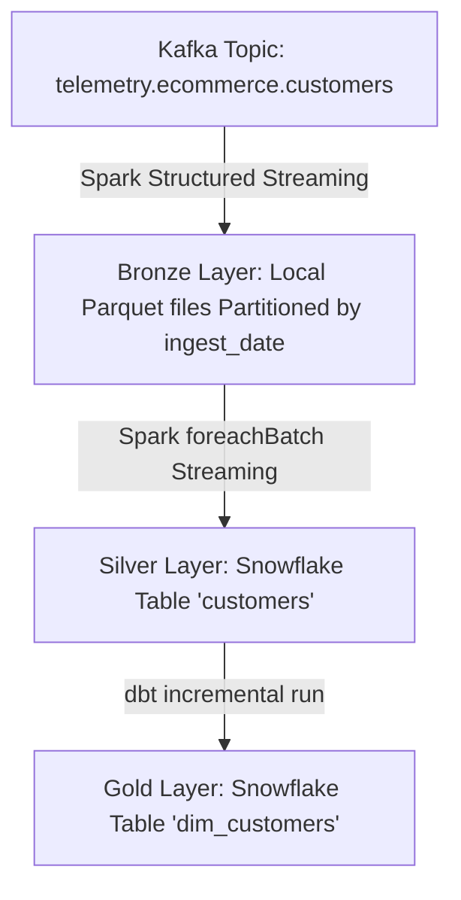

# RetailCortex Project Context & Architecture Map

This document serves as the high-level technical map and single source of truth for the **RetailCortex** project context. It outlines the architecture, data flows, current implementations, schema definitions, and major architectural vulnerabilities to avoid re-reading all source files repeatedly.

---

## 1. Project High-Level Architecture
RetailCortex is a retail intelligence platform that processes e-commerce customer data using a **Medallion Architecture** (Bronze → Silver → Gold):
*   **Ingestion (Source to Bronze):** A PySpark Structured Streaming job consumes customer events from Kafka and writes them to local Parquet files (Bronze layer) partitioned by `ingest_date`.
*   **Transformation (Bronze to Silver):** A PySpark streaming job processes the Bronze Parquet stream, applies basic transformations (cleansing, string-to-timestamp parsing, string lower/upper casing), and appends it to a **Snowflake** table (`customers`) in the `SILVER` schema via a Spark micro-batch writer (`foreachBatch`).
*   **Modeling & Analytics (Silver to Gold):** A **dbt** project compiles SQL transformations to incrementally build dimensional tables (`dim_customers` and `dim_dates`) in the Snowflake `GOLD` schema.



---

## 2. Directory & Artifact Map

```
c:\Project\RetailContex\
├── README.md                           # Basic project description
├── cmd.md                              # Core CLI commands for running ingestion, transformation, and dbt
├── config/
│   ├── kafka.yaml                      # Kafka topics and bootstrap servers configuration
│   └── snowflake.yaml                  # Snowflake warehouse, database, schema, and role attributes
├── Data/
│   ├── bronze/customers/               # Raw ingested customer data in local Parquet format
│   └── checkpoints/                    # Spark streaming checkpoints (customers, silver_customers)
├── src/
│   ├── common/
│   │   ├── config.py                   # Dynamic .env loading and YAML configuration loaders
│   │   ├── paths.py                    # Centralized path generation using pathlib.Path
│   │   ├── reader.py                   # PySpark Kafka stream and Parquet reader utilities
│   │   ├── spark.py                    # PySpark session builder with bundled connectors (Kafka, Snowflake)
│   │   └── writer.py                   # PySpark Parquet streaming and Snowflake batch writer utilities
│   ├── ingestion/
│   │   └── customer_kafka_stream.py    # Bronze streaming pipeline from Kafka to local Parquet
│   ├── schemas/
│   │   └── customer.py                 # Spark schema definitions (CUSTOMER_SCHEMA, CUSTOMER_BRONZE_SCHEMA)
│   └── transformation/
│       └── customer.py                 # Silver streaming pipeline from Bronze to Snowflake using foreachBatch
└── dbt_retail/                         # dbt Project for Gold Layer modelling
    ├── dbt_project.yml                 # dbt project configurations (schema structures, materializations)
    ├── packages.yml                    # dbt external package dependencies (e.g., dbt_date)
    ├── macros/
    │   └── generate_schema_name.sql    # Custom schema name resolution macro
    └── models/
        ├── silver/
        │   └── sources.yml             # External Silver layer source registration
        └── gold/
            ├── dim_customers.sql       # Incremental Customer Dimension table with merge strategy
            └── dim_dates.sql           # Static Date Dimension table using dbt_date package
```

---

## 3. Core Component Contexts

### A. Configurations
*   **Kafka (`config/kafka.yaml`):**
    *   `bootstrap_servers`: `localhost:9092` (hardcoded)
    *   `topics.customers`: `telemetry.ecommerce.customers`
*   **Snowflake (`config/snowflake.yaml`):**
    *   `warehouse`: `COMPUTE_WH`
    *   `database`: `RETAIL_DB`
    *   `schema`: `SILVER`
    *   `role`: `ACCOUNTADMIN` (critical security vulnerability)
*   **Environment Variables (`.env`):**
    *   Used in `config.py` to retrieve sensitive credentials: `SNOWFLAKE_URL`, `SNOWFLAKE_USER`, `SNOWFLAKE_PASSWORD`.

### B. PySpark Schemas (`src/schemas/customer.py`)
Currently contains two schemas. A major issue is that both store datetime and boolean values as **strings**:
1.  **`CUSTOMER_SCHEMA`**: Contains fields: `created_at` (String), `customer_id` (String), `customer_status` (String), `email` (String), `first_name` (String), `is_deleted` (String), `last_name` (String), `phone` (String), `registered_at` (String), `updated_at` (String), and `created_time` (Timestamp).
2.  **`CUSTOMER_BRONZE_SCHEMA`**: Inherits string data types for `created_at`, `registered_at`, `updated_at`, `is_deleted`, and `created_time`. Includes metadata fields: `ingest_time` (Timestamp) and `ingest_date` (Date).

### C. Pipeline Implementation Summary
1.  **Bronze Ingestion (`customer_kafka_stream.py`):**
    *   Builds Spark session with Kafka, Snowflake, and JDBC connectors.
    *   Reads from Kafka `telemetry.ecommerce.customers` topic.
    *   Parses JSON `value` using `CUSTOMER_SCHEMA` (converting it to string first).
    *   Adds `ingest_time` (current timestamp) and `ingest_date` (date from ingest time).
    *   Streams to local Parquet files partitioned by `ingest_date` with checkpoints at `Data/checkpoints/customers`.
2.  **Silver Transformation (`src/transformation/customer.py`):**
    *   Reads Bronze Parquet files as a stream using `CUSTOMER_BRONZE_SCHEMA`.
    *   Converts date/timestamp string columns to actual `TimestampType` using `to_timestamp`.
    *   Normalizes data: `email` to lowercase, `customer_status` to uppercase, casts `is_deleted` to boolean.
    *   Enriches record with a concatenated `full_name` column.
    *   Selects final column subset: `customer_id`, `full_name`, `email`, `phone`, `customer_status`, `registered_at`, `ingest_time`, `is_deleted`, `created_at`, `updated_at`.
    *   Saves micro-batches incrementally to Snowflake table `customers` using `foreachBatch` pointing to `write_snowflake_batch` in "append" mode (results in data duplication).

### D. dbt Layer Context (`dbt_retail/`)
*   **`dbt_project.yml`**: Structure separates Silver and Gold targets.
    *   Silver models default to `view` materialization under schema `silver`.
    *   Gold models default to `table` materialization under schema `gold`.
*   **`models/silver/sources.yml`**: Registers Snowflake `RETAIL_DB.SILVER.customers` table as source. Lacks freshness or quality assertions.
*   **`models/gold/dim_customers.sql`**: Incremental materialization with `unique_key='customer_id'` and `merge` strategy. Scans incrementally where `ingest_time` is greater than the max target `silver_ingest_time`. No SCD Type 2 history preservation is implemented (pure Type 1 overwrite).
*   **`models/gold/dim_dates.sql`**: Table materialization calling `dbt_date.get_date_dimension("2020-01-01", "2030-12-31")` and casting the `date_day` column to an integer `date_key` (YYYYMMDD).

---

## 4. Key Security & Design Vulns (To Be Remedied)
1.  **Snowflake `ACCOUNTADMIN` Over-Privileging:** Applications load the root admin role. Must be refactored to use a custom, least-privileged role.
2.  **No Kafka Security:** Unsecured connection details are defined in YAML config and reader utilities.
3.  **Local Storage Reliance:** All Spark paths are bound to local directories via `PROJECT_ROOT = Path.cwd()`, failing to support production cloud object storage (S3/ADLS).
4.  **No True Upsert (Data Duplication):** The Silver writer runs `mode("append")` inside `foreachBatch`, resulting in duplicated customer records in Snowflake instead of performing a dynamic `MERGE`.
5.  **Missing SCD Type 2:** Customer Dimension in dbt overwritten incrementally without preserving history.
6.  **Missing Alerting, DLQ, and Quality Testing:** No Dead Letter Queue for malformed Kafka events, no monitoring, and no dbt validation/freshness checks.
